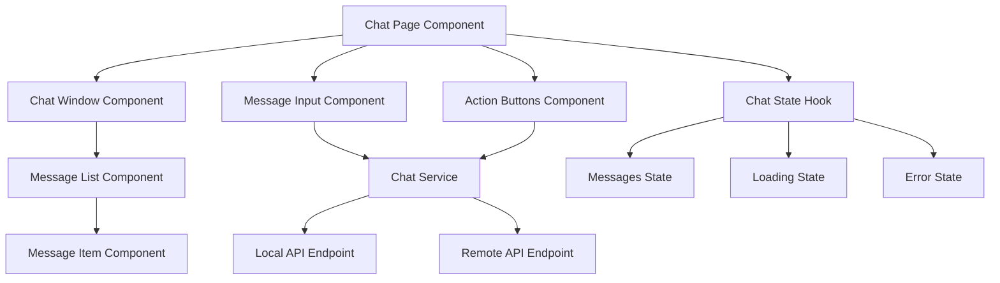

# Design Document

## Overview

The Next.js chat application will be a single-page application featuring a clean, modern chat interface. The application will use React hooks for state management, implement proper error handling, and provide a responsive design that works across devices. The architecture will be component-based with clear separation of concerns between UI components, API services, and state management.

## Architecture

The application will follow a standard Next.js architecture with the following key layers:

- **Presentation Layer**: React components for UI rendering
- **Service Layer**: API communication utilities
- **State Management**: React hooks for local state management
- **Configuration Layer**: Environment-based configuration for endpoints



## Components and Interfaces

### Core Components

#### 1. ChatPage Component
- **Purpose**: Main page component that orchestrates the entire chat interface
- **Props**: None (page-level component)
- **State**: Manages overall chat state through custom hook
- **Responsibilities**: Layout, state coordination, error boundary

#### 2. ChatWindow Component
- **Purpose**: Displays the conversation history
- **Props**: `messages: Message[]`, `isLoading: boolean`
- **Responsibilities**: Message rendering, auto-scroll, empty state

#### 3. MessageInput Component
- **Purpose**: Text input for composing messages
- **Props**: `onSendMessage: (message: string) => void`, `disabled: boolean`
- **State**: Input value, validation
- **Responsibilities**: Message composition, Enter key handling, validation

#### 4. ActionButtons Component
- **Purpose**: Three action buttons for send operations and clearing
- **Props**: `onSendLocal: () => void`, `onSendRemote: () => void`, `onClear: () => void`, `disabled: boolean`
- **Responsibilities**: Button interactions, loading states

#### 5. MessageItem Component
- **Purpose**: Individual message display
- **Props**: `message: Message`, `type: 'user' | 'assistant' | 'error'`
- **Responsibilities**: Message formatting, timestamp display

### Data Models

#### Message Interface
```typescript
interface Message {
  id: string;
  content: string;
  type: 'user' | 'assistant' | 'error';
  timestamp: Date;
  source?: 'local' | 'remote';
}
```

#### API Request Interface
```typescript
interface ChatRequest {
  prompt: string;
}

interface ChatResponse {
  response?: string;
  error?: string;
}
```

#### Chat State Interface
```typescript
interface ChatState {
  messages: Message[];
  isLoading: boolean;
  error: string | null;
  currentInput: string;
}
```

### Service Layer

#### ChatService Class
- **Purpose**: Handle all API communications
- **Methods**:
  - `sendToLocal(message: string): Promise<string>`
  - `sendToRemote(message: string): Promise<string>`
- **Configuration**: Endpoint URLs, timeout settings, headers
- **Error Handling**: Network errors, timeout errors, API errors

## Error Handling

### Error Categories
1. **Network Errors**: Connection failures, timeouts
2. **API Errors**: Server errors, invalid responses
3. **Validation Errors**: Empty messages, invalid input
4. **Configuration Errors**: Missing endpoints, invalid URLs

### Error Display Strategy
- **Toast Notifications**: For temporary errors (network issues)
- **Inline Messages**: For persistent errors in chat window
- **Button States**: Disabled states for invalid operations
- **Retry Mechanisms**: Automatic retry for transient failures

### Error Recovery
- **Graceful Degradation**: Continue functioning when one endpoint fails
- **User Feedback**: Clear error messages with actionable guidance
- **State Preservation**: Maintain chat history during errors

## Testing Strategy

### Unit Testing
- **Component Testing**: React Testing Library for component behavior
- **Service Testing**: Mock API calls and test error scenarios
- **Hook Testing**: Custom hooks with various state scenarios
- **Utility Testing**: Message formatting, validation functions

### Integration Testing
- **API Integration**: Test actual endpoint communication
- **User Flow Testing**: Complete user interactions
- **Error Scenario Testing**: Network failures, API errors
- **Accessibility Testing**: Screen reader compatibility, keyboard navigation

### Test Coverage Areas
1. **Message Sending**: Both local and remote endpoints
2. **Error Handling**: All error scenarios and recovery
3. **State Management**: Message history, loading states
4. **User Interactions**: Button clicks, keyboard input, clearing
5. **Responsive Design**: Mobile and desktop layouts
6. **Accessibility**: ARIA labels, focus management

### Testing Tools
- **Jest**: Unit testing framework
- **React Testing Library**: Component testing
- **MSW (Mock Service Worker)**: API mocking
- **Cypress**: End-to-end testing (optional)

## Implementation Considerations

### Performance
- **Message Virtualization**: For large chat histories
- **Debounced Input**: Prevent excessive re-renders
- **Memoization**: Optimize component re-renders
- **Lazy Loading**: Code splitting for better initial load

### Security
- **Input Sanitization**: Prevent XSS attacks
- **CORS Configuration**: Proper cross-origin handling
- **Environment Variables**: Secure endpoint configuration
- **Request Validation**: Validate all outgoing requests

### Accessibility
- **ARIA Labels**: Proper labeling for screen readers
- **Keyboard Navigation**: Full keyboard accessibility
- **Focus Management**: Logical focus flow
- **Screen Reader Announcements**: New message notifications

### Responsive Design
- **Mobile-First**: Design for mobile, enhance for desktop
- **Flexible Layout**: Adapt to various screen sizes
- **Touch-Friendly**: Appropriate button sizes for touch
- **Readable Text**: Proper font sizes and contrast ratios